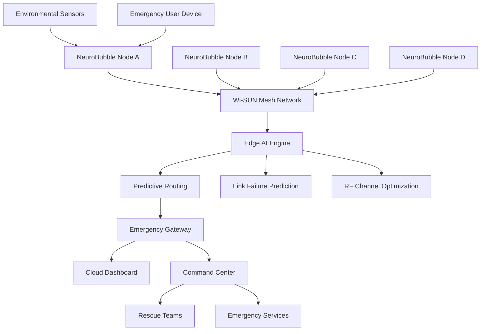
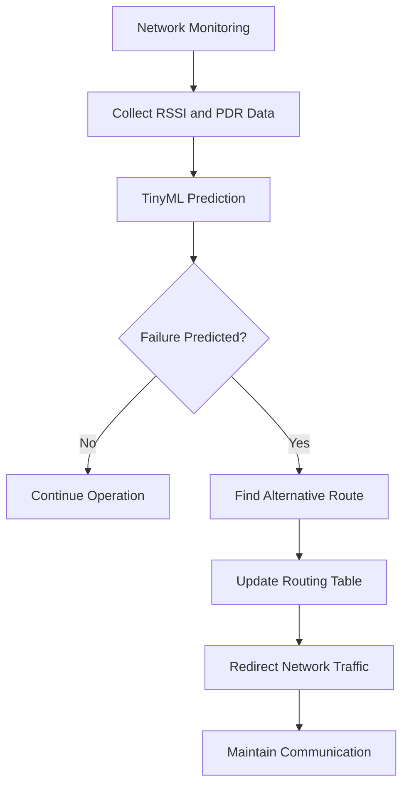

# Centre of Innovation in IoT Project Description

# NeuroBubble: AI-Powered Emergency Self-Healing Communication Network

---

# 1. Project Overview

## Project Description

NeuroBubble is an AI-powered emergency communication platform designed to maintain reliable connectivity in situations where conventional communication infrastructure becomes unavailable or unreliable. The system creates an intelligent self-healing wireless mesh network using Silicon Labs wireless devices, enabling emergency communication without dependence on cellular towers, internet connectivity, or centralized infrastructure.

The project combines Wi-SUN mesh networking, Edge AI, and TinyML to continuously monitor network conditions and predict communication failures before they occur. Each network node analyzes signal strength, packet delivery performance, battery status, and RF interference levels to make intelligent routing decisions. When a node fails or network quality degrades, NeuroBubble automatically reroutes communication through the most efficient path, ensuring uninterrupted connectivity.

The system is designed for disaster response teams, emergency services, industrial facilities, military operations, remote communities, and smart infrastructure deployments where resilient communication is critical.

## Objectives

* Establish communication in infrastructure-less environments.
* Create a self-healing wireless mesh network.
* Predict communication failures using AI.
* Improve network reliability and coverage.
* Enable emergency messaging and sensor monitoring.
* Demonstrate advanced Silicon Labs wireless technologies.

## Real-Life Applications

### Disaster Management

During earthquakes, floods, cyclones, or landslides, communication towers may become unavailable. NeuroBubble can be rapidly deployed to establish emergency communication between rescue teams and affected communities.

### Forest Fire Monitoring

Sensor nodes deployed in forests can communicate fire alerts even when parts of the network are damaged by fire.

### Military Operations

Provides secure and adaptive communication in remote areas where infrastructure is unavailable.

### Remote Village Connectivity

Creates community communication networks in rural regions with limited cellular coverage.

### Industrial Emergency Networks

Maintains communication between workers and control centers during industrial accidents or power failures.

### Smart Cities

Acts as a backup communication infrastructure during emergencies and large public events.

---

# 2. Technical Architecture

## System Architecture

## Self-Healing Communication Flow

---

# 3. Technologies Used

## Wireless Technologies

* Wi-SUN Mesh Networking
* Bluetooth Low Energy (BLE)
* Sub-GHz Communication
* IPv6 Networking
* MQTT
* Edge-to-Cloud Communication

## AI and Intelligence

* TinyML
* Edge AI
* Predictive Analytics
* Adaptive Routing Algorithms

## SDKs and Frameworks

* Silicon Labs Gecko SDK (GSDK)
* FreeRTOS
* CMSIS-NN
* TensorFlow Lite for Microcontrollers

## Programming Languages

* C
* C++
* Python
* JavaScript

## Development Tools

* Simplicity Studio
* VS Code
* GitHub
* CMake
* Wireshark
* Node-RED

---

# 4. Hardware Components

## Silicon Labs Hardware

### Main Controller

* EFR32MG24 Wireless SoC

### Development Boards

* xG24 Explorer Kit
* Wireless Pro Kit

### Communication Technologies

* Wi-SUN Stack
* Bluetooth LE Stack

### Sensors

* Environmental Sensors
* Temperature Sensors
* Humidity Sensors
* Battery Monitoring Circuit

---

## External Hardware

### Processing and Gateway

* Raspberry Pi 5

### Positioning

* GPS Module (NEO-6M)

### Power System

* Li-Ion Battery Pack
* Solar Charging Module

### Debugging and Testing

* Logic Analyzer
* Oscilloscope
* USB-UART Debugger

### Communication Backup

* LoRa Module (Optional)

---

# 5. Key Features

## AI-Based Link Failure Prediction

The system predicts communication failures before they occur using TinyML models trained on:

* RSSI
* SNR
* Packet Delivery Ratio
* Network Congestion
* Battery Levels

## Self-Healing Mesh Network

* Automatic route discovery
* Dynamic rerouting
* Node failure recovery

## RF-Aware Communication

* Adaptive channel selection
* Interference detection
* Signal quality optimization

## Emergency Communication Services

* SOS messaging
* Rescue team coordination
* Sensor alerts
* Network health monitoring

## Energy-Aware Routing

* Battery-based path selection
* Power-efficient communication
* Extended network lifetime

---

# 6. Example Deployment Scenario

## Flood Disaster Response

1. Flood damages cellular towers.
2. Rescue teams deploy NeuroBubble nodes.
3. Nodes automatically create a Wi-SUN mesh network.
4. AI evaluates communication quality.
5. Citizens send SOS alerts through the network.
6. Rescue teams receive real-time location and status updates.
7. If a node becomes unreachable, traffic is automatically rerouted.

Result:

* Reliable emergency communication
* Reduced response time
* Increased rescue efficiency

---

# 7. Software Components / Dependencies

## Silicon Labs Dependencies

| Component         | Version                  |
| ----------------- | ------------------------ |
| Simplicity Studio | v5.x                     |
| Gecko SDK (GSDK)  | v4.x                     |
| Wi-SUN Stack      | Latest Supported Version |
| Bluetooth SDK     | Latest Supported Version |
| CMSIS-NN          | Latest Version           |

---

## External Software Dependencies

| Software              | Purpose                 |
| --------------------- | ----------------------- |
| TensorFlow Lite Micro | TinyML Inference        |
| FreeRTOS              | Real-Time Scheduling    |
| Node-RED              | Dashboard Visualization |
| MQTT Broker           | Messaging               |
| Python                | Data Analytics          |
| GitHub Actions        | CI/CD                   |
| Wireshark             | Packet Analysis         |

---

# 8. Licensing

## Project License

Apache License 2.0

This project will be released under the Apache 2.0 License to encourage community contributions and open-source development.

## Third-Party Licenses

* TensorFlow Lite Micro — Apache 2.0
* FreeRTOS — MIT License
* CMSIS-NN — Apache 2.0
* Node-RED — Apache 2.0

---

# 9. Maintainers / Contacts

| Name          | Role                      | Contact Information                                         | GitHub Profile                  |
| ------------- | ------------------------- | ----------------------------------------------------------- | ------------------------------- |
| Devang Shukla | Project Lead & Developer  | [devangshukla218@gmail.com](mailto:devangshukla218@gmail.com) | [https://github.com/devangshukla](https://github.com/Devilwelcometohell) |
| Aditya Kumar   | Embedded Systems Engineer | [adityakumar65348@gmail.com](mailto:adityakumar65348@gmail.com)| [https://github.com/Aditya-KumarEC](https://github.com/Aditya-KumarEC)  |

---

# Future Scope

* Integration with autonomous drones for aerial communication relays.
* Federated learning across mesh nodes.
* AI-based cyberattack detection.
* Satellite gateway integration.
* Smart city emergency communication infrastructure.
* Autonomous deployment using robotic systems.

NeuroBubble demonstrates how Artificial Intelligence, Edge Computing, and Silicon Labs wireless technologies can be combined to create a resilient next-generation communication platform capable of maintaining connectivity in the most challenging environments.
